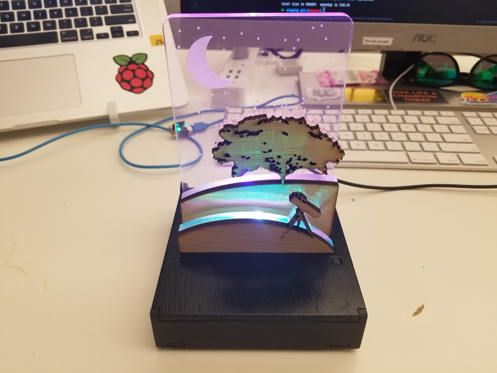
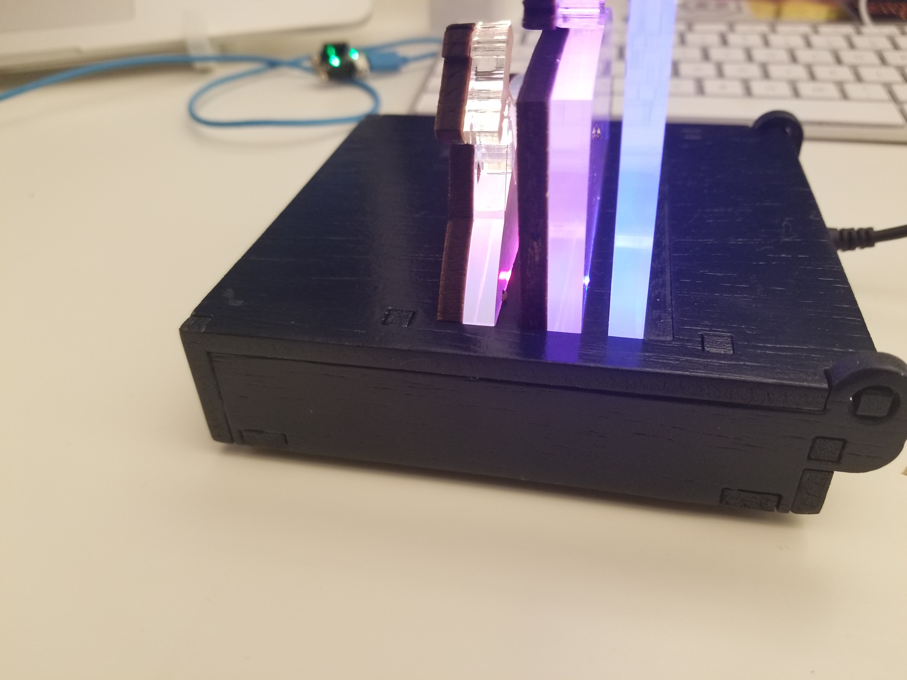
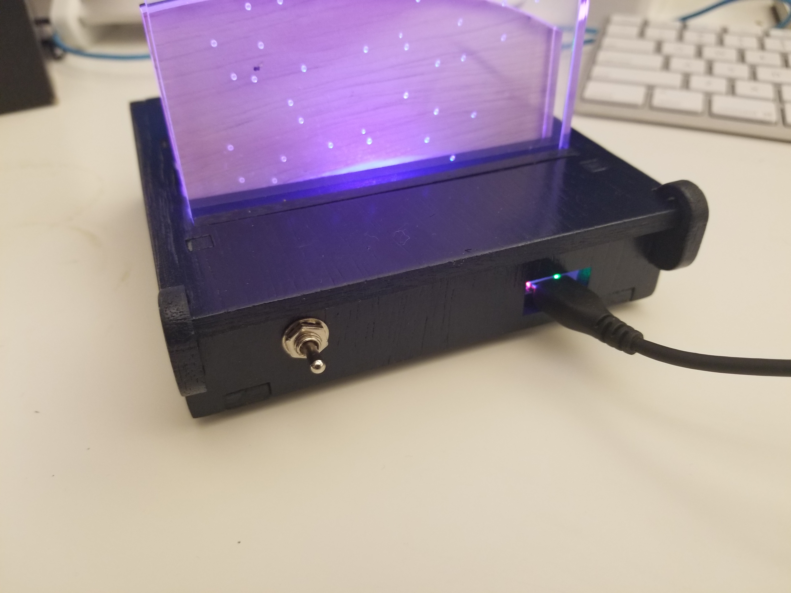
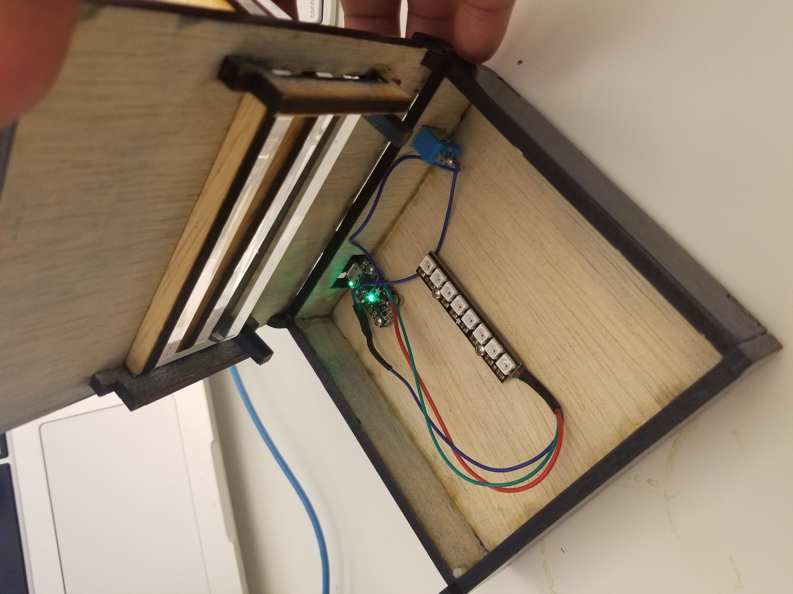
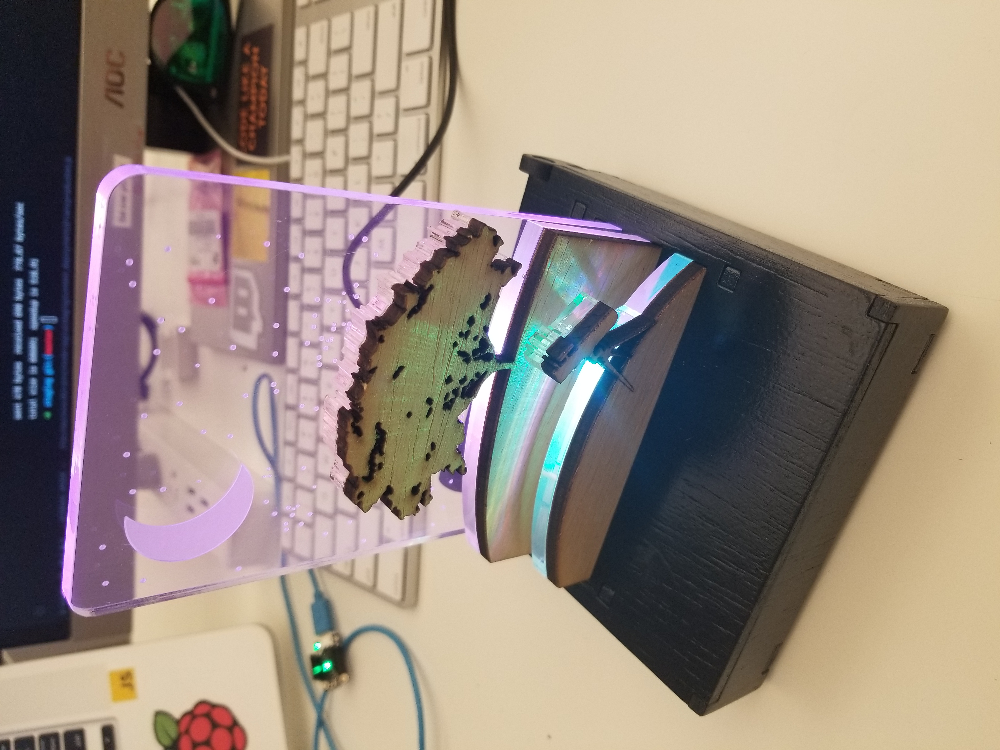
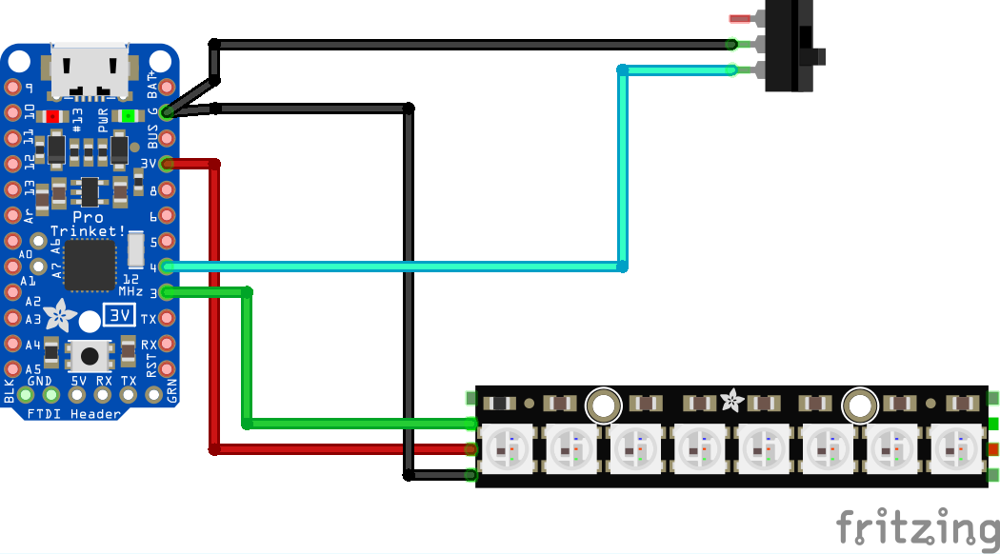

# circuit-python-acrylic-nightlight
A nightlight I created for my daughter using an adafruit trinket, circuit python, a laser cutter, acrylic, and plywood.

Project complete video: https://vimeo.com/240650785

# Shopping list
- [Adafruit Trinket M0](https://www.adafruit.com/product/3500)
    - 9 dollars
    - Really it could be any arduino board as long as it can drive a neopixel
- [Adafruit Neopixel Stick](https://www.adafruit.com/product/1426)
    - 6 dollars
    - I used the 8 LED stick
- [M2.5 self tapping screws](https://www.amazon.com/gp/product/B071DWY1Z5/ref=oh_aui_detailpage_o02_s00?ie=UTF8&psc=1)
    - ~ 5 dollars for 100
    - _Order these first_! It took a month for me to get these in and none of my local hardware stores carried this small of a size
- [SPST latching mini toggle switch](https://www.amazon.com/gp/product/B01JU6KBH6/ref=oh_aui_detailpage_o06_s00?ie=UTF8&psc=1)
    - ~ 11 dollars for 20
- [5mm thick plywood from any hardware or lumber store](https://www.homedepot.com/p/Sanded-Plywood-Common-5-2-mm-x-2-ft-x-4-ft-Actual-0-205-in-x-23-75-in-x-47-75-in-1511004/202088924)
    - ~10 dollars from home depot
    - I used sande plywood
- [Quarter inch thick (6.35mm) lucite acrylic](https://www.inventables.com/technologies/lucite-light-guide-acrylic-sheet)
    - 12 ~ 50 dollars from inventables depending on size
    - If you're doing one panel the 8x12 panel would be fine

# Tools needed
- A laser cutter or CNC mill to cut the acrylic
- A laser cutter to cut the plywood
- Wood glue
- Spray paint for the box
- Stranded core wire
- Soldering iron and solder

# Wiring guide
I couldn't find a fritzing component for the M0 trinket so I'm using the regular trinket. Eveything I'm using is digital IO so the pin usage should be the same, but the code is written using circuit python so you need the M0 (or another circuit python enabled board) to run the code.

If there's enough interest I would consider making an assembly guide. Hopefully this is a good enough starting point for now.